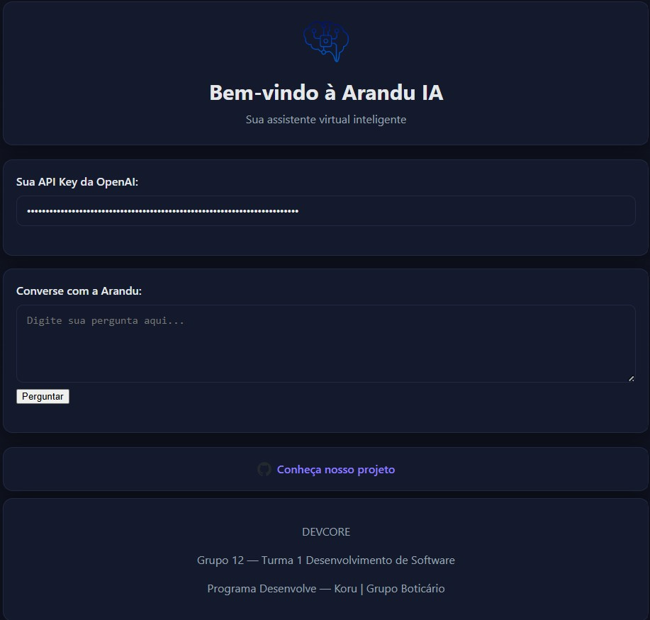

Arandu IA

💡 Desenvolvido por um time incrível:
👩‍💻 Catarine Formiga de Farias
👨‍💻 Valmer Benedito Mariano
👩‍💻 Cassia Deiro Brito Mota
👩‍💻 Carla Paloma Freires dos Santos
👨‍💻 Mario Henrique dos Santos Souza
👩‍💻 Paola Pontes
📸 Resultado Final

(A imagem mostra a interface final com tema escuro e layout limpo.)

O Arandu IA é um assistente virtual inteligente desenvolvido como parte das aulas 22 a 25 do curso de Desenvolvimento de Software.
O objetivo do projeto foi integrar diferentes APIs de inteligência artificial (como OpenAI e Google Gemini) a uma interface web leve, feita inteiramente em HTML, CSS e JavaScript puro — sem dependências externas.

O foco foi criar uma aplicação rápida, responsiva e intuitiva, com recursos que melhoram a experiência do usuário, como:

    Atalhos de teclado para envio de mensagens

    Feedback visual de carregamento

    Opções para copiar e limpar respostas

    Armazenamento local seguro da chave de API

✨ Funcionalidades Principais

    Integração com API de IA:

        OpenRouter

    Interface amigável:

        Campo para pergunta e API Key

        Exibição de respostas formatadas

        Estados de carregamento

    Recursos extras:

        Copiar resposta para clipboard

        Salvar API Key no localStorage

        Atalho Ctrl+Enter para enviar

        Validação de formulários

        Tratamento de erros

⚙️ Pré-requisitos

    Navegador moderno (Chrome, Firefox, Safari, Edge)

    Chave de API da OpenAI ou Google Gemini

    Conhecimentos básicos de HTML/CSS/JS

🚀 Como usar

    Abra o index.html no navegador (de preferência via HTTPS ou localhost).

    Insira sua API Key do OpenRouter.

    Digite a pergunta e clique em Perguntar ou pressione Enter.

    Copie ou limpe a resposta usando os botões.

📂 Estrutura

arandu-ia/
├─ img/ # Imagens e ícones
├─ css/style.css # Estilos
├─ js/script.js # Lógica principal
└─ index.html # Interface

✨ Recursos

    Salva API Key no navegador

    Envio por Enter, Shift+Enter (quebra linha) e Ctrl+Enter

    Botão para copiar última resposta

    Botão para limpar conversa

    Layout responsivo e tema escuro automático

🔑 API

O código já vem apontando para o OpenRouter:

const URL_OPENROUTER = "https://openrouter.ai/api/v1/chat/completions";

Basta gerar a sua chave e colar no campo de API Key.
📜 Licença

MIT — uso livre para estudos e modificações.
